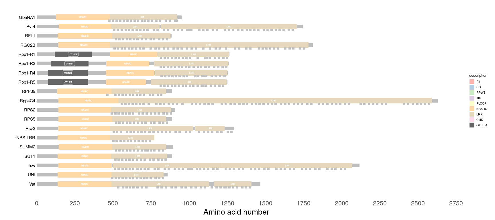

Drawing NLR domain architecture with refplantnlR
================
Jiorgos Kourelis
30 July, 2021

# refplantnlR

`refplantnlR` is a package for drawing NLR domain architecture. Either
provide it with the NLRtracker output, or load the RefPlantNLR dataset
or NCBI RefSeq NLR dataset and the function does (most of) the rest!

## Installation

To install you’ll need the `devtools` R package. From the R console in
RStudio type

``` r
install.packages("devtools")
```

Once `devtools` is installed you can use that to install `refplantnlR`

``` r
devtools::install_github("JKourelis/refplantnlR")
```

## Preparation

The first step is to load our domain architecture data file and do some
basic filtering

### Data loading

First read in your domain file output from NLRtracker. You can do that
with `read.delim()`. Must contain a minimum of one “CHAIN” as data$type.

``` r
library(dplyr)
library(refplantnlR)
RefPlantNLR <- RefPlantNLR
head(RefPlantNLR)
#>   Status    seqname Subclass Domain_simplified              Species       Order
#> 1    NLR       3gG2   CC-NLR               CNL          Glycine max     Fabales
#> 2    NLR      Adnr1   CC-NLR             OCNLO    Triticum aestivum      Poales
#> 3    NLR Adnr1-RGA4   CC-NLR               CNL    Triticum aestivum      Poales
#> 4    NLR       ADR1  CCR-NLR               RNL Arabidopsis thaliana Brassicales
#> 5    NLR    ADR1-L1  CCR-NLR               RNL Arabidopsis thaliana Brassicales
#> 6    NLR    ADR1-L2  CCR-NLR               RNL Arabidopsis thaliana Brassicales
#>     Pathogen       Genus Representative  type description start  end
#> 1      Virus     Glycine            YES CHAIN       chain     1 1129
#> 2 Arthropods    Triticum            YES CHAIN       chain     1 1482
#> 3     HELPER    Triticum             NO CHAIN       chain     1  997
#> 4     HELPER Arabidopsis            YES CHAIN       chain     1  787
#> 5     HELPER Arabidopsis            YES CHAIN       chain     1  816
#> 6     HELPER Arabidopsis            YES CHAIN       chain     1  811
```

### Filter as required

We can now filter the NLRs to select only the ones with e.g integrated
domains, using `filter()`

``` r
filtered_RefPlantNLR <- filter(RefPlantNLR, grepl("O", Domain_simplified),
                               Status == "NLR")
head(filtered_RefPlantNLR)
#>   Status seqname Subclass Domain_simplified                     Species
#> 1    NLR   Adnr1   CC-NLR             OCNLO           Triticum aestivum
#> 2    NLR    CHS3  TIR-NLR              TNLO        Arabidopsis thaliana
#> 3    NLR    DAR5  CCR-NLR              RNOO        Arabidopsis thaliana
#> 4    NLR   Pi-ta   CC-NLR              CNLO Oryza sativa Japonica Group
#> 5    NLR   Pi1-5   CC-NLR              CONL   Oryza sativa Indica Group
#> 6    NLR   Pi5-3   CC-NLR              CNLO Oryza sativa Japonica Group
#>         Order     Pathogen       Genus Representative  type description start
#> 1      Poales   Arthropods    Triticum            YES CHAIN       chain     1
#> 2 Brassicales AUTOIMMUNITY Arabidopsis            YES CHAIN       chain     1
#> 3 Brassicales         <NA> Arabidopsis            YES CHAIN       chain     1
#> 4      Poales        Fungi       Oryza            YES CHAIN       chain     1
#> 5      Poales        Fungi       Oryza            YES CHAIN       chain     1
#> 6      Poales         <NA>       Oryza            YES CHAIN       chain     1
#>    end
#> 1 1482
#> 2 1613
#> 3  702
#> 4 1033
#> 5 1143
#> 6 1049
```

### Draw the NLR domain architecture

We can now draw the domain architecture

``` r
p <- draw_nlr(filtered_RefPlantNLR)
p
```


We can modify the output to also plot the NB-ARC motifs

``` r
filtered_RefPlantNLR <- filter(RefPlantNLR, Subclass == "CCR-NLR")
p <- draw_nlr(filtered_RefPlantNLR, label_motifs = TRUE)
p
```


Finally, specifically for the RefPlantNLR dataset we can also label the
individual LRRs

``` r
filtered_RefPlantNLR <- filter(RefPlantNLR, Subclass == "CCG10-NLR")
p <- draw_nlr(filtered_RefPlantNLR, label_repeats = TRUE)
p
```


