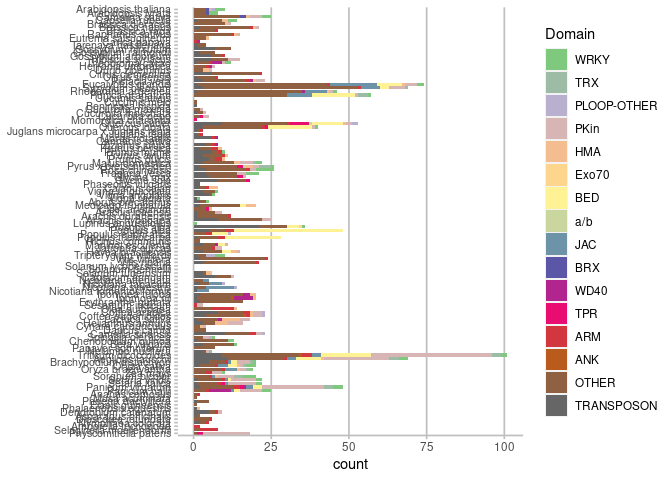

Drawing NLR domain architecture with refplantnlR
================
Jiorgos Kourelis
30 July, 2021

# refplantnlR

`refplantnlR` is a package for drawing NLR domain architecture. Either
provide it with the NLRtracker output, or load the RefPlantNLR dataset
or NCBI RefSeq NLR dataset and the function does (most of) the rest!

## Installation

To install you’ll need the `devtools` R package. From the R console in
RStudio type

``` r
install.packages("devtools")
```

Once `devtools` is installed you can use that to install `refplantnlR`

``` r
devtools::install_github("JKourelis/refplantnlR")
```

## Preparation

The first step is to load our domain architecture data file and do some
basic filtering

### Data loading

First read in your domain file output from NLRtracker. You can do that
with `read.delim()`. Must contain a minimum of one “CHAIN” as data$type.

``` r
library(dplyr)
library(refplantnlR)
RefPlantNLR <- RefPlantNLR
head(RefPlantNLR)
#>   Status    seqname Subclass Domain_simplified              Species       Order
#> 1    NLR       3gG2   CC-NLR               CNL          Glycine max     Fabales
#> 2    NLR      Adnr1   CC-NLR             OCNLO    Triticum aestivum      Poales
#> 3    NLR Adnr1-RGA4   CC-NLR               CNL    Triticum aestivum      Poales
#> 4    NLR       ADR1  CCR-NLR               RNL Arabidopsis thaliana Brassicales
#> 5    NLR    ADR1-L1  CCR-NLR               RNL Arabidopsis thaliana Brassicales
#> 6    NLR    ADR1-L2  CCR-NLR               RNL Arabidopsis thaliana Brassicales
#>     Pathogen       Genus Representative  type description start  end
#> 1      Virus     Glycine            YES CHAIN       chain     1 1129
#> 2 Arthropods    Triticum            YES CHAIN       chain     1 1482
#> 3     HELPER    Triticum             NO CHAIN       chain     1  997
#> 4     HELPER Arabidopsis            YES CHAIN       chain     1  787
#> 5     HELPER Arabidopsis            YES CHAIN       chain     1  816
#> 6     HELPER Arabidopsis            YES CHAIN       chain     1  811
```

### Filter as required

We can now filter the NLRs to select only the ones with e.g integrated
domains, using `filter()`

``` r
filtered_RefPlantNLR <- filter(RefPlantNLR, grepl("O", Domain_simplified),
                               Status == "NLR")
head(filtered_RefPlantNLR)
#>   Status seqname Subclass Domain_simplified                     Species
#> 1    NLR   Adnr1   CC-NLR             OCNLO           Triticum aestivum
#> 2    NLR    CHS3  TIR-NLR              TNLO        Arabidopsis thaliana
#> 3    NLR    DAR5  CCR-NLR              RNOO        Arabidopsis thaliana
#> 4    NLR   Pi-ta   CC-NLR              CNLO Oryza sativa Japonica Group
#> 5    NLR   Pi1-5   CC-NLR              CONL   Oryza sativa Indica Group
#> 6    NLR   Pi5-3   CC-NLR              CNLO Oryza sativa Japonica Group
#>         Order     Pathogen       Genus Representative  type description start
#> 1      Poales   Arthropods    Triticum            YES CHAIN       chain     1
#> 2 Brassicales AUTOIMMUNITY Arabidopsis            YES CHAIN       chain     1
#> 3 Brassicales         <NA> Arabidopsis            YES CHAIN       chain     1
#> 4      Poales        Fungi       Oryza            YES CHAIN       chain     1
#> 5      Poales        Fungi       Oryza            YES CHAIN       chain     1
#> 6      Poales         <NA>       Oryza            YES CHAIN       chain     1
#>    end
#> 1 1482
#> 2 1613
#> 3  702
#> 4 1033
#> 5 1143
#> 6 1049
```

### Draw the NLR domain architecture

We can now draw the domain architecture

``` r
p <- draw_nlr(filtered_RefPlantNLR)
p
```


We can modify the output to also plot the NB-ARC motifs

``` r
filtered_RefPlantNLR <- filter(RefPlantNLR, Subclass == "CCR-NLR")
p <- draw_nlr(filtered_RefPlantNLR, label_motifs = TRUE)
p
```


Finally, specifically for the RefPlantNLR dataset we can also label the
individual LRRs

``` r
filtered_RefPlantNLR <- filter(RefPlantNLR, Subclass == "CCG10-NLR")
p <- draw_nlr(filtered_RefPlantNLR, label_repeats = TRUE)
p
```


### Oher types of analysis

With the prepackaged NLRtracker output from all plant NCBI RefSeq
proteomes we can do some additional analysis besides plotting the domain
architecture. For example we can plot the number of NLR loci that
contain potential integratd domains

``` r
library(tidyverse)

# The dataset
RefSeq_NLR <- RefSeq_NLR

## Filtering to select a single splice-variant per locus, prioritizing the ones with integrated domains
RefSeq_NLR_LOCUS <- RefSeq_NLR %>%
  filter(Status %in% c("NLR", "degenerate NLR")) %>% # Select only NLRs
  mutate(ID = case_when(str_detect(Domain_simplified, "O") ~ "YES", # Add a column for whether the NLR contains a putative integrated domain
                        TRUE ~ "NO")) %>%
  group_by(RefSeq, Locus) %>%
  arrange(desc(ID),
          desc(Status)) %>%
  slice(1) %>% # Select a single splice-variant per locus
  ungroup %>%
  filter(!grepl("SUPPRESSED", Species)) %>% # Remove the suppressed RefSeq genomes
  group_by(RefSeq, Species, ID) %>%
  summarise(count = n()) %>% 
  mutate(perc = (count/sum(count))*100)

head(RefSeq_NLR_LOCUS)
#> # A tibble: 6 × 5
#> # Groups:   RefSeq, Species [3]
#>   RefSeq          Species               ID    count  perc
#>   <chr>           <chr>                 <chr> <int> <dbl>
#> 1 GCF_000001735.4 Arabidopsis thaliana  NO      167 95.4 
#> 2 GCF_000001735.4 Arabidopsis thaliana  YES       8  4.57
#> 3 GCF_000002425.4 Physcomitrella patens NO       39 68.4 
#> 4 GCF_000002425.4 Physcomitrella patens YES      18 31.6 
#> 5 GCF_000002775.4 Populus trichocarpa   NO      454 94.2 
#> 6 GCF_000002775.4 Populus trichocarpa   YES      28  5.81
  
ggplot(data = RefSeq_NLR_LOCUS, aes(x = Species, y = count, fill = ID)) + 
  geom_bar(stat = "identity") +
  scale_x_discrete(limits = c("Physcomitrella patens", "Selaginella moellendorffii", # non-flowering plants
                              "Amborella trichopoda", "Nymphaea colorata", # Magnoliopsida
                              "Dioscorea rotundata", "Asparagus officinalis", "Dendrobium catenatum", "Phalaenopsis equestris", # Liliopsida, Petrosaviidae
                              "Elaeis guineensis", "Phoenix dactylifera", # Liliopsida, Petrosaviidae, Arecales 
                              "Musa acuminata", # Liliopsida, Petrosaviidae, Zingiberales
                              "Ananas comosus", # Liliopsida, Petrosaviidae, Poales, Bromeliaceae 
                              "Panicum hallii", "Panicum virgatum", "Setaria italica", "Setaria viridis", "Sorghum bicolor", "Zea mays", # Liliopsida, Petrosaviidae, Poales, Poaceae, PACMAD clade
                              "Oryza brachyantha", "Oryza sativa", "Brachypodium distachyon", "Aegilops tauschii", "Triticum dicoccoides", # Liliopsida, Petrosaviidae, Poales, Poaceae, BOP clade
                              "Nelumbo nucifera", "Papaver somniferum", # Eudicotyledons
                              "Beta vulgaris", "Chenopodium quinoa", "Spinacia oleracea", # Eudicotyledons, Superasterids, Caryophyllales
                              "Camellia sinensis", # Eudicotyledons, Superasterids, Asterids, Ericales
                              "Daucus carota", "Cynara cardunculus", "Helianthus annuus", "Lactuca sativa", # Eudicotyledons, Superasterids, Asterids, campanulids
                              "Coffea eugenioides", "Coffea arabica", # Eudicotyledons, Superasterids, Asterids, Lamiids, Gentianales
                              "Olea europaea", "Sesamum indicum", "Erythranthe guttata", # Eudicotyledons, Superasterids, Asterids, Lamiids, Lamiales
                              "Ipomoea nil", "Ipomoea triloba", # Eudicotyledons, Superasterids, Asterids, Lamiids, Solanales, Convolvulaceae
                              "Nicotiana tomentosiformis", "Nicotiana sylvestris", "Nicotiana tabacum", "Nicotiana attenuata", "Capsicum annuum", "Solanum tuberosum", "Solanum pennellii", "Solanum lycopersicum", # Eudicotyledons, Superasterids, Asterids, Lamiids, Solanales, Solanaceae
                              "Vitis riparia", "Vitis vinifera", # Eudicotyledons, Rosids, rosids incertae sedis, Vitales
                              "Tripterygium wilfordii", # Eudicotyledons, Rosids, Fabids, Celastrales
                              "Hevea brasiliensis", "Jatropha curcas", "Manihot esculenta", "Ricinus communis", "Populus trichocarpa", "Populus euphratica", "Populus alba", # Eudicotyledons, Rosids, Fabids, Malpighiales
                              "Prosopis alba", "Lupinus angustifolius", "Arachis hypogaea", "Arachis duranensis", "Arachis ipaensis", "Cicer arietinum", "Medicago truncatula", "Abrus precatorius", "Vigna radiata", "Vigna angularis", "Vigna unguiculata", "Cajanus cajan", "Phaseolus vulgaris", "Glycine soja", "Glycine max", # Eudicotyledons, Rosids, Fabids, Fabales
                              "Fragaria vesca", "Rosa chinensis", "Pyrus x bretschneideri", "Malus domestica", "Prunus dulcis", "Prunus avium", "Prunus mume", "Prunus persica", "Ziziphus jujuba", "Cannabis sativa", "Morus notabilis", # Eudicotyledons, Rosids, Fabids, Rosales
                              "Juglans regia", "Juglans microcarpa x Juglans regia", "Quercus lobata", "Quercus suber", # Eudicotyledons, Rosids, Fabids, Fagales
                              "Momordica charantia", "Cucurbita pepo", "Cucurbita moschata", "Cucurbita maxima", "Benincasa hispida", "Cucumis melo", "Cucumis sativus", # Eudicotyledons, Rosids, Fabids, Cucurbitales
                              "Punica granatum", "Rhodamnia argentea", "Syzygium oleosum", "Eucalyptus grandis", # Eudicotyledons, Rosids, Malvids, Myrtales
                              "Pistacia vera", "Citrus sinensis", "Citrus clementina", # Eudicotyledons, Rosids, Malvids, Sapindales
                              "Durio zibethinus", "Herrania umbratica", "Theobroma cacao", "Hibiscus syriacus", "Gossypium arboreum", "Gossypium raimondii", "Gossypium hirsutum", # Eudicotyledons, Rosids, Malvids, Malvales
                              "Tarenaya hassleriana", "Carica papaya", "Eutrema salsugineum", "Raphanus sativus", "Brassica rapa", "Brassica napus", "Brassica oleracea", "Capsella rubella", "Camelina sativa", "Arabidopsis lyrata", "Arabidopsis thaliana" # Eudicotyledons, Rosids, Malvids, Brassicales
                              )) + 
  scale_y_continuous(breaks = c(0, 250, 500, 750, 1000, 1250)) +
  scale_fill_manual(values = c("YES" = "#F0027F", "NO" = "#386CB0")) + 
  coord_flip() +
  theme(panel.background = element_rect(fill = NA),
        panel.grid.major = element_line(colour = "#BFBFBF", size = 0.6),
        panel.grid.major.y = element_line(colour = NA),
        axis.line.x = element_line(color = "#BFBFBF", size = 0.6),
        axis.ticks.x = element_line(color = "#BFBFBF", size = 0.6),
        axis.ticks.y = element_line(color = "#BFBFBF", size = 0.6),
        axis.text.y = element_text(angle = 0, hjust = 1, size = 8),
        axis.title.y=element_blank())
```


We can also plot the types of integrated domains found

``` r
RefSeq_NLR_ID_DEDUP <- RefSeq_NLR %>%
  filter(!grepl("SUPPRESSED", Species), # Remove the suppressed RefSeq genomes
         Status %in% c("NLR", "degenerate NLR"), # Filter for NLRs
         grepl("O", Domain_simplified), # Extract NLRs containing a potential integrated domain
         !type %in% c("CHAIN", "MOTIF", "REGION")) %>% # Remove CHAIN and MOTIF and REGION (canonical NLR domains)
  separate_rows(Domain, sep = "\\)\\(") %>% # Separate out the domains
  mutate(Domain = str_replace(Domain, "\\(", ""),
         Domain = str_replace(Domain, "\\)", "")) %>%
  filter(!Domain %in% c("R1", "RPW8", "TIR", "CC", "NBARC", "PLOOP", "LRR", "CJID")) %>% # Remove the canonical NLR domains from the domain architecture analysis
  group_by(RefSeq, Locus) %>%
  distinct(Domain, .keep_all = TRUE) %>% # Deduplicate the integrated domains per locus. 
  group_by(RefSeq, Species, Domain) %>%
  summarise(count = n()) %>% 
  mutate(perc = (count/sum(count))*100,
         Domain = factor(Domain, levels = c("WRKY", "TRX", "PLOOP-OTHER", "PKin", "HMA", "Exo70", "BED", "a/b", "JAC", "BRX", "WD40", "TPR", "ARM", "ANK", "OTHER", "TRANSPOSON")))

head(RefSeq_NLR_ID_DEDUP)
#> # A tibble: 6 × 5
#> # Groups:   RefSeq, Species [2]
#>   RefSeq          Species               Domain      count  perc
#>   <chr>           <chr>                 <fct>       <int> <dbl>
#> 1 GCF_000001735.4 Arabidopsis thaliana  BRX             1 10   
#> 2 GCF_000001735.4 Arabidopsis thaliana  OTHER           4 40   
#> 3 GCF_000001735.4 Arabidopsis thaliana  PKin            1 10   
#> 4 GCF_000001735.4 Arabidopsis thaliana  PLOOP-OTHER     1 10   
#> 5 GCF_000001735.4 Arabidopsis thaliana  WRKY            3 30   
#> 6 GCF_000002425.4 Physcomitrella patens OTHER           1  5.56

ggplot(data = RefSeq_NLR_ID_DEDUP, aes(x = Species, y = count, fill = Domain)) + 
  geom_bar(stat = "identity") +
  scale_x_discrete(limits = c("Physcomitrella patens", "Selaginella moellendorffii", # non-flowering plants
                              "Amborella trichopoda", "Nymphaea colorata", # Magnoliopsida
                              "Dioscorea rotundata", "Asparagus officinalis", "Dendrobium catenatum", "Phalaenopsis equestris", # Liliopsida, Petrosaviidae
                              "Elaeis guineensis", "Phoenix dactylifera", # Liliopsida, Petrosaviidae, Arecales 
                              "Musa acuminata", # Liliopsida, Petrosaviidae, Zingiberales
                              "Ananas comosus", # Liliopsida, Petrosaviidae, Poales, Bromeliaceae 
                              "Panicum hallii", "Panicum virgatum", "Setaria italica", "Setaria viridis", "Sorghum bicolor", "Zea mays", # Liliopsida, Petrosaviidae, Poales, Poaceae, PACMAD clade
                              "Oryza brachyantha", "Oryza sativa", "Brachypodium distachyon", "Aegilops tauschii", "Triticum dicoccoides", # Liliopsida, Petrosaviidae, Poales, Poaceae, BOP clade
                              "Nelumbo nucifera", "Papaver somniferum", # Eudicotyledons
                              "Beta vulgaris", "Chenopodium quinoa", "Spinacia oleracea", # Eudicotyledons, Superasterids, Caryophyllales
                              "Camellia sinensis", # Eudicotyledons, Superasterids, Asterids, Ericales
                              "Daucus carota", "Cynara cardunculus", "Helianthus annuus", "Lactuca sativa", # Eudicotyledons, Superasterids, Asterids, campanulids
                              "Coffea eugenioides", "Coffea arabica", # Eudicotyledons, Superasterids, Asterids, Lamiids, Gentianales
                              "Olea europaea", "Sesamum indicum", "Erythranthe guttata", # Eudicotyledons, Superasterids, Asterids, Lamiids, Lamiales
                              "Ipomoea nil", "Ipomoea triloba", # Eudicotyledons, Superasterids, Asterids, Lamiids, Solanales, Convolvulaceae
                              "Nicotiana tomentosiformis", "Nicotiana sylvestris", "Nicotiana tabacum", "Nicotiana attenuata", "Capsicum annuum", "Solanum tuberosum", "Solanum pennellii", "Solanum lycopersicum", # Eudicotyledons, Superasterids, Asterids, Lamiids, Solanales, Solanaceae
                              "Vitis riparia", "Vitis vinifera", # Eudicotyledons, Rosids, rosids incertae sedis, Vitales
                              "Tripterygium wilfordii", # Eudicotyledons, Rosids, Fabids, Celastrales
                              "Hevea brasiliensis", "Jatropha curcas", "Manihot esculenta", "Ricinus communis", "Populus trichocarpa", "Populus euphratica", "Populus alba", # Eudicotyledons, Rosids, Fabids, Malpighiales
                              "Prosopis alba", "Lupinus angustifolius", "Arachis hypogaea", "Arachis duranensis", "Arachis ipaensis", "Cicer arietinum", "Medicago truncatula", "Abrus precatorius", "Vigna radiata", "Vigna angularis", "Vigna unguiculata", "Cajanus cajan", "Phaseolus vulgaris", "Glycine soja", "Glycine max", # Eudicotyledons, Rosids, Fabids, Fabales
                              "Fragaria vesca", "Rosa chinensis", "Pyrus x bretschneideri", "Malus domestica", "Prunus dulcis", "Prunus avium", "Prunus mume", "Prunus persica", "Ziziphus jujuba", "Cannabis sativa", "Morus notabilis", # Eudicotyledons, Rosids, Fabids, Rosales
                              "Juglans regia", "Juglans microcarpa x Juglans regia", "Quercus lobata", "Quercus suber", # Eudicotyledons, Rosids, Fabids, Fagales
                              "Momordica charantia", "Cucurbita pepo", "Cucurbita moschata", "Cucurbita maxima", "Benincasa hispida", "Cucumis melo", "Cucumis sativus", # Eudicotyledons, Rosids, Fabids, Cucurbitales
                              "Punica granatum", "Rhodamnia argentea", "Syzygium oleosum", "Eucalyptus grandis", # Eudicotyledons, Rosids, Malvids, Myrtales
                              "Pistacia vera", "Citrus sinensis", "Citrus clementina", # Eudicotyledons, Rosids, Malvids, Sapindales
                              "Durio zibethinus", "Herrania umbratica", "Theobroma cacao", "Hibiscus syriacus", "Gossypium arboreum", "Gossypium raimondii", "Gossypium hirsutum", # Eudicotyledons, Rosids, Malvids, Malvales
                              "Tarenaya hassleriana", "Carica papaya", "Eutrema salsugineum", "Raphanus sativus", "Brassica rapa", "Brassica napus", "Brassica oleracea", "Capsella rubella", "Camelina sativa", "Arabidopsis lyrata", "Arabidopsis thaliana" # Eudicotyledons, Rosids, Malvids, Brassicales
                              )) + 
  scale_fill_manual(values = colorRampPalette(RColorBrewer::brewer.pal(12, "Accent"))(length(unique(RefSeq_NLR_ID_DEDUP$Domain)))) +
  scale_y_continuous(breaks = c(0, 25, 50, 75, 100)) +
  coord_flip() +
  theme(panel.background = element_rect(fill = NA),
        panel.grid.major = element_line(colour = "#BFBFBF", size = 0.6),
        panel.grid.major.y = element_line(colour = NA),
        axis.line.x = element_line(color = "#BFBFBF", size = 0.6),
        axis.ticks.x = element_line(color = "#BFBFBF", size = 0.6),
        axis.ticks.y = element_line(color = "#BFBFBF", size = 0.6),
        axis.text.y = element_text(angle = 0, hjust = 1, size = 8),
        axis.title.y=element_blank())
#> Warning in RColorBrewer::brewer.pal(12, "Accent"): n too large, allowed maximum for palette Accent is 8
#> Returning the palette you asked for with that many colors
```


